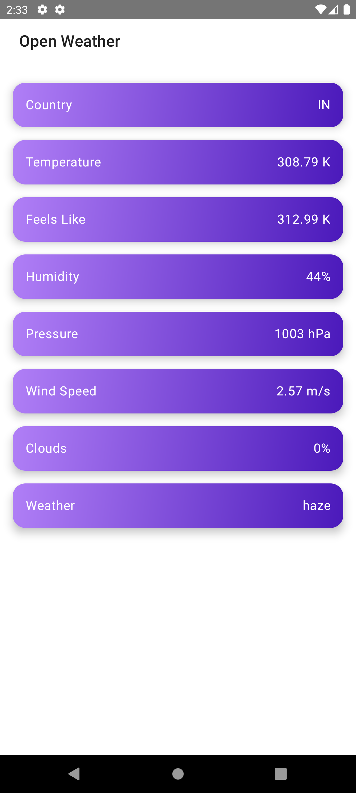

# KMP Project

This is a Kotlin Multiplatform (KMP) project designed to target both Android and iOS platforms, with features such as dependency injection, network requests, and Jetpack Compose for UI development.

## Table of Contents
- [Project Structure](#project-structure)
- [Requirements](#requirements)
- [Libraries and Tools](#libraries-and-tools)
- [Setup Instructions](#setup-instructions)
- [KMP Features](#kmp-features)

## Project Structure
This project is organized into a shared module and platform-specific modules for Android and iOS. Shared business logic, such as networking and dependency injection, is placed in the shared module, while UI code is separated by platform.

## Requirements
- Android Studio Flamingo or later
- Xcode 14 or later (for iOS development)
- Kotlin 2.0.20
- Gradle 8.5.2

## Libraries and Tools

### 1. **Koin for Dependency Injection**
Koin is used for managing dependencies across both platforms, allowing for shared ViewModels and DI configurations.

- `koin-core`
- `koin-android`
- `koin-androidx-compose`
- `koin-compose-viewmodel`

### 2. **Ktor for Networking**
Ktor handles HTTP networking, with support for different engines across platforms (OkHttp for Android, Darwin for iOS). Serialization is done via `kotlinx.serialization`.

- `ktor-client-core`
- `ktor-client-okhttp`
- `ktor-client-darwin`
- `ktor-client-content-negotiation`
- `ktor-serialization-kotlinx-json`

### 3. **Jetpack Compose for UI**
On Android, we are using Jetpack Compose for declarative UI development. Compose components are integrated with ViewModels through Koin.

- `androidx-activity-compose`
- `navigation-compose`
- `androidx-lifecycle-runtime-compose`

### 4. **Gradle Plugins**
We use several Gradle plugins to simplify project configuration:

- `kotlin-multiplatform`
- `android-application`
- `android-library`
- `compose-compiler`
- `kotlin-serialization`

## Setup Instructions

### Android
1. Clone the repository.
2. Open the project in Android Studio.
3. Sync the project with Gradle files.
4. Build and run the Android app.

### iOS
1. Open `iosApp` in Xcode.
2. Build and run the iOS app using the desired simulator or physical device.

### Shared Code
The shared module contains platform-independent business logic. This includes networking with Ktor, dependency injection with Koin, and Kotlin coroutines for concurrency.

To make changes to shared code:
1. Modify the code in the `/shared` module.
2. Rebuild the project.

## KMP Features

- **Dependency Injection:** Shared ViewModels across platforms using Koin.
- **Networking:** Ktor for HTTP requests with engine-specific implementations for Android and iOS.
- **Jetpack Compose UI:** Modern declarative UI for Android.
- **Serialization:** Using Kotlinx Serialization to handle JSON data in a cross-platform manner.

## License
This project is licensed under the MIT License - see the [LICENSE](LICENSE) file for details.
